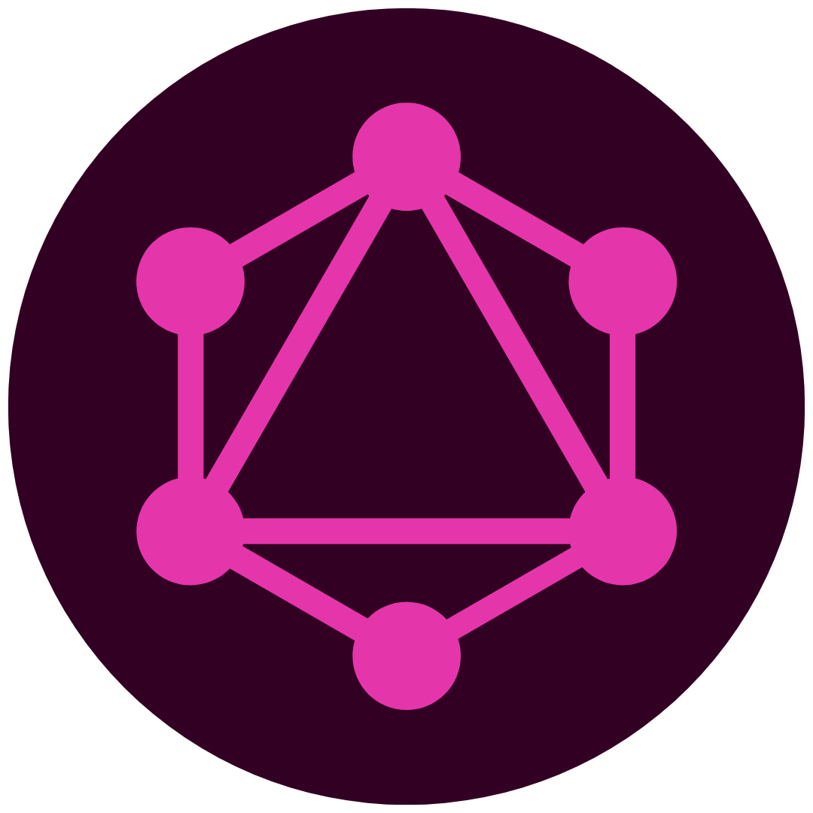

<!--Name-->

    
     
    Shopify-focused full-stack developer

<!--Tech Stack and Tools-->

 &nbsp;
 &nbsp;
 &nbsp;
 &nbsp;
 &nbsp;
 &nbsp;
 &nbsp;
 &nbsp;
 &nbsp;
 &nbsp;
 &nbsp;
 &nbsp;
 &nbsp;
 &nbsp;
 &nbsp;

<!--Projects-->