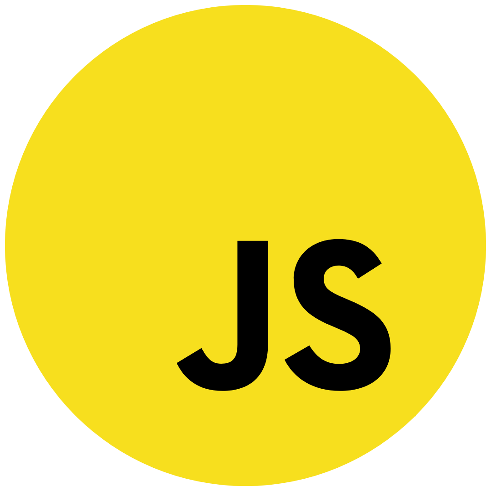

<!--Name-->

<h3 align="center">
    <strong>Hi, I'm John Jeffrey Jamen 👋</strong>
</h3>

    Founder of <a href="https://omsim.io"><b>omsim.io</b></a> and a Shopify-focused full-stack developer.

<!--Tech Stack-->

#### Tech and Tools

 &nbsp;
 &nbsp;
 &nbsp;
 &nbsp;
 &nbsp;
 &nbsp;
 &nbsp;
 &nbsp;
 &nbsp;
 &nbsp;

